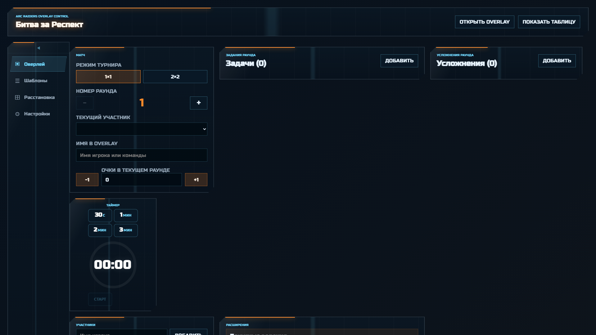
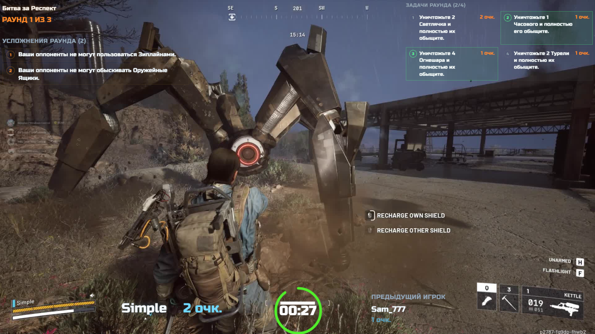

# Битва за Респект — OBS Overlay для турниров по Arc Raiders

**React + Vite** приложение для стрим-оверлея турниров по игре **Arc Raiders**.

Оверлей накладывается поверх стрима через **OBS Browser Source** и отображает: текущий раунд, имя и очки игрока/команды, задания, таймер, турнирную таблицу и усложнения. Управление — через админ-панель организатора с синхронизацией по WebSocket.

## Скриншоты

### Админ-панель организатора



### Оверлей для OBS



---

## Быстрый запуск

```bash
pnpm install
pnpm dev
```

Или просто запустите `start.bat` — он проверит зависимости и запустит оба сервера.

---

## Доступ

| Путь | Назначение |
|------|------------|
| `http://localhost:5173/overlay` | Оверлей для OBS (прозрачный фон) |
| `http://localhost:5173/admin` | Админ-панель организатора |
| `ws://localhost:3001` | WebSocket-сервер синхронизации |

---

## Настройка OBS

1. Добавьте **Browser Source**.
2. **URL:** `http://localhost:5173/overlay`
3. **Width:** `1920`, **Height:** `1080`
4. Включите прозрачный фон, если OBS предлагает эту опцию.
5. Откройте `http://localhost:5173/admin` в отдельной вкладке и управляйте раундом, участниками, очками и задачами.

---

## Возможности

### Оверлей (OBS)
- Прозрачный фон для наложения на стрим
- Дизайн в стиле Arc Raiders: цветовая схема, шрифты, UI-элементы
- Drag-and-drop редактор расстановки виджетов
- Масштабирование виджетов (колесом мыши в редакторе)
- Адаптивный скейлинг под размер окна OBS

### Админ-панель организатора

#### Управление турниром
- **Режимы турнира:** `1×1` (соло) и `2×2` (команды)
- **Управление раундом:** переключение раундов, настройка количества (1–10)
- **Участники:** добавление игроков и команд (2 игрока в команде)
- **Очки:** ручное начисление/вычитание, авто-начисление при выполнении задач
- **Вкладки админки:** Основное / Шаблоны / Редактор / Настройки

#### Задачи раунда
- Добавление из шаблонов, ручное создание, отметка выполнения
- **Рулетка задач:** случайный подбор задания из оставшихся шаблонов с анимацией
- **Настройка стоимости:** степпер `−` / `+` для изменения баллов за каждое задание
- **Бонусные задания:** два дополнительных слота, заполняемых перед раундом

#### Библиотека шаблонов
- 25 PvE/PvP заданий, 16 усложнений (включая авторские от подписчиков Boosty)
- Добавление, редактирование и удаление собственных шаблонов

#### Усложнения раунда
- Добавление из шаблонов, ручное создание
- **Рулетка усложнений:** случайный подбор усложнения из оставшихся шаблонов с анимацией
- **Штраф за нарушение:** степпер `−` / `+` для вычитания/возврата очков при нарушении условия (стоимость нарушения — 1 очко)

#### Таймер
- Пресеты 30с / 1мин / 2мин / 3мин, пауза/сброс

#### Турнирная таблица
- Standings по всем участникам, сортировка по очкам

#### Виджеты оверлея
- **Виджет предыдущего игрока** — отображает имя и очки прошлого участника
- **Виджет усложнений** — список активных усложнений раунда на стриме

#### Настройки
- **Название турнира** — редактируемое поле
- **Количество раундов** — степпер 1–10
- **Звуковые эффекты** — вкл/выкл (Web Audio API)
- **Экспорт/Импорт** состояния турнира в JSON

#### Горячие клавиши
- `↑` / `↓` — переключение между участниками

### Синхронизация
- **WebSocket** (`server.js`, порт 3001) — единый источник истины
- **localStorage** — персистентность между сессиями + синхронизация вкладок через `storage` event
- Защита от эхо-петли: флаг `syncingFromServer` предотвращает повторную отправку полученных данных
- Версионирование состояния и аудит-лог на сервере
- Авто-переподключение WebSocket-клиента

---

## Продакшн-сборка

Для стрима рекомендуется использовать production-сборку (быстрее, меньше размер):

```bash
pnpm build
pnpm preview --host 0.0.0.0
```

После сборки статические файлы будут в `dist/`. Можно раздавать их через любой веб-сервер (nginx, serve).

Для синхронизации оверлея с админкой всё ещё нужен WebSocket-сервер:

```bash
node server.js
```

---

## Горячие клавиши (админка)

| Клавиша | Действие |
|---------|----------|
| `↑` / `↓` | Переключение между участниками |

---

## Структура проекта

```
src/
├── main.jsx                     # Точка входа React
├── App.jsx                      # Роутер: /admin или /overlay
├── styles.css                   # Дизайн в стиле Arc Raiders (1860 строк)
├── components/
│   ├── Timer.jsx                # Таймер (Web Audio + SVG-кольцо)
│   └── ErrorBoundary.jsx        # Предохранитель ошибок виджетов
├── hooks/
│   └── useServerSync.js         # WebSocket-клиент с авто-переподключением
├── pages/
│   ├── Admin.jsx                # Админ-панель (роутинг по вкладкам)
│   ├── AdminOverlayTab.jsx      # Основная вкладка: матч, задачи, таймер, участники
│   ├── Overlay.jsx              # Оверлей для OBS (8 виджетов)
│   ├── Templates.jsx            # Библиотека шаблонов заданий и усложнений
│   ├── LayoutEditor.jsx         # Drag-and-drop редактор виджетов
│   └── Settings.jsx             # Настройки: название, раунды, звук, экспорт/импорт
├── state/
│   ├── TournamentContext.jsx    # Глобальное состояние + WebSocket-синхронизация
│   ├── tournamentDefaults.js    # Значения по умолчанию
│   ├── layoutDefaults.js        # Конфигурация виджетов оверлея (1920×1080)
│   └── templateStore.js         # Хранилище шаблонов (localStorage)
└── utils/
    └── sounds.js                # Звуковые эффекты (Web Audio API)

server.js                        # WebSocket sync-сервер (порт 3001)
server_v2.js                     # Альтернативная версия сервера (порт 3002)
vite.config.js                   # Vite + React плагин
```

### Виджеты оверлея

| ID | Виджет | Описание |
|----|--------|----------|
| `tournament-name` | Название турнира | Отображает `Битва за Респект` |
| `round` | Раунд | «Раунд X из Y» |
| `score` | Счёт | Имя игрока и текущие очки (с анимацией) |
| `tasks` | Задачи | Сетка задач раунда с прогрессом |
| `timer` | Таймер | SVG-кольцо с обратным отсчётом |
| `previous-player` | Предыдущий игрок | Имя и очки предыдущего участника |
| `standings` | Турнирная таблица | Позиции всех участников |
| `complications` | Усложнения | Список активных усложнений раунда |

---

## Технологический стек

| Компонент | Технология |
|-----------|------------|
| Frontend | React 19 |
| Сборка | Vite 6 |
| Стили | CSS (переменные, 1860 строк) |
| Шрифты | Avant Garde Overlay (кастомный), Russo One, Rajdhani |
| WebSocket | `ws` (Node.js) |
| Звуки | Web Audio API |
| Хранение | `localStorage` + JSON-файл на сервере |
| Пакетный менеджер | pnpm |

---

## Экспорт / Импорт

В админке (вкладка «Настройки») есть кнопки экспорта и импорта состояния турнира в JSON-файл. Используйте для бэкапа или переноса между компьютерами.

